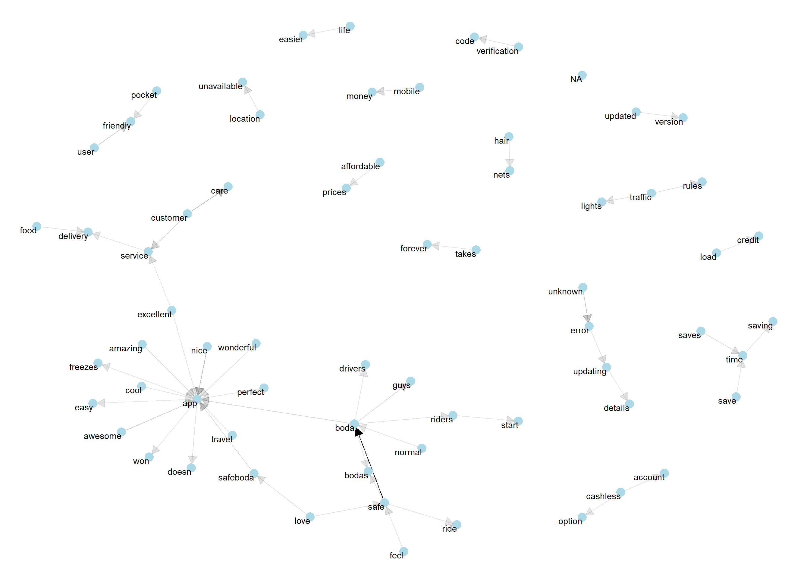

<!-- README.md is generated from README.Rmd. Please edit that file -->

# appstorr 

[](https://opensource.org/licenses/mit-license.php)

## Background
I worked on a simple Text Analysis on Safe Boda Google Play Store Reviews
[Link](https://simonsayz.xyz/post/text-analysis-of-safeboda-app-google-play-store-reviews-in-r/) and someone challenged me to work on an R package to make the same analysis easier and faster for any company with an App. 

## Installation

The latest stable version (if any) could be found on
[GitHub](https://github.com/tagasimon/appstorr), and installed using
`devtools` package.

``` r
if (!require(devtools)) install.packages("devtools")
devtools::install_github("tagasimon/appstorr")
```

## Example

The package is extremely easy to use. Almost everything could be done in
one line of code. 

```{r}
df <- appstorr::df_safeboda
appstorr::quick_report(data = df, 
                       report_title = "Awesome SafeBoda Text Analysis Report")
```

### Future Work
1. A Sentiment Model to Predict a Rating Based the content in the Review.

2. Work on an Interactive Web Application to bring the Analysis to Life for any Application on Google Play Store

